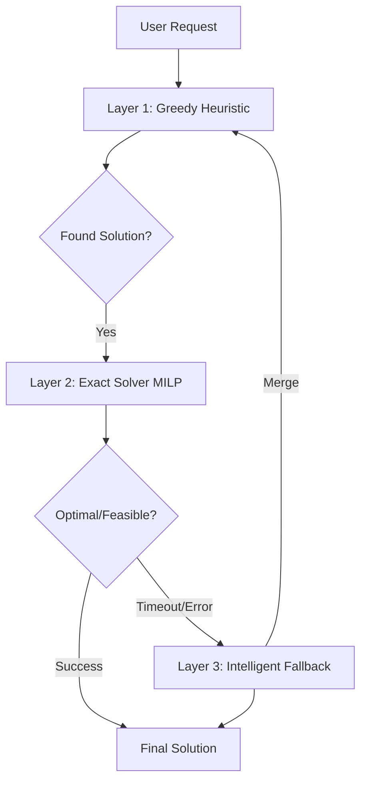

# Optimization Integration Guide: 3-Layer Robust Framework

This guide outlines how to port the scheduling engine developed in the "Thesis Article" project to any future optimization project using **Google OR-Tools**.

## 1. The 3-Layer Architecture
Never rely on the solver alone. Implement this hierarchy to guarantee a solution even under extreme complexity.



### Key Principle: "Operational Safety Over Mathematical Perfection"
Always return the best heuristic solution if the solver fails to find a better one within the time limit.

---

## 2. Core Strategy: Lexicographical Optimization
Break your problem into two phases. This prevents the solver from getting stuck trying to balance conflicting goals.

### Phase 1: Coverage (Minimize Unmet Demand)
```python
# Objective: Minimize penalty for not serving a slot
unmet_penalty = sum(U[d] * 5000 for d in range(num_periods))
solver.Minimize(unmet_penalty)
status = solver.Solve()
```

### Phase 2: Resource (Minimize Active Drivers)
```python
if status in (OPTIMAL, FEASIBLE):
    # Lock the coverage found in Phase 1
    for d in range(num_periods):
        solver.Add(U[d] <= U[d].solution_value() + tolerance)
    
    # Secondary Objective: Minimize resources
    solver.Minimize(sum(Z[t] for t in range(limit_workers)))
    status = solver.Solve()
```

---

## 3. The "Warm Start" (Hints)
Injecting a heuristic solution into the exact solver can speed up convergence by 10x.

```python
def set_solver_hints(solver, X, initial_solution):
    if hasattr(solver, 'SetHint'):
        vars_list = []
        vals_list = []
        for d, t in indices:
            vars_list.append(X[d, t])
            vals_list.append(float(initial_solution[d, t]))
        solver.SetHint(vars_list, vals_list)
```

---

## 4. Metrics: "The Rule of the Whole Process"
Ensure your KPIs reflect the physical reality of the tasks, not just the mathematical density.

| Metric | Formula | Intent |
| :--- | :--- | :--- |
| **Avg Load (tasks/slot)** | `Total Tasks / Count(Working Slots)` | Intensity per discrete action. |
| **Avg Hours/Driver** | `(Working Slots * Slot Duration) / Active Drivers` | Actual driver workload. |
| **Worker Efficiency** | `Total Served / Total Capacity Available` | Utilization rate. |

---

## 5. Portability Checklist
When moving this to a new project, copy and adapt these core modules:
1.  **`engine.py`**: The bridge between your business logic and OR-Tools.
2.  **`heuristic.py`**: Your safety net for when the solver times out.
3.  **Validation Logic**: Always run a post-solver script to verify constraints manually (don't trust the solver result status blindly!).

> [!IMPORTANT]
> **Resilience is better than Optimality.** A 99% good solution delivered in 5 seconds is better than a 100% optimal solution that never finishes or crashes the server.

---
*Created as part of the Solver Maturity Leap - February 2026*
